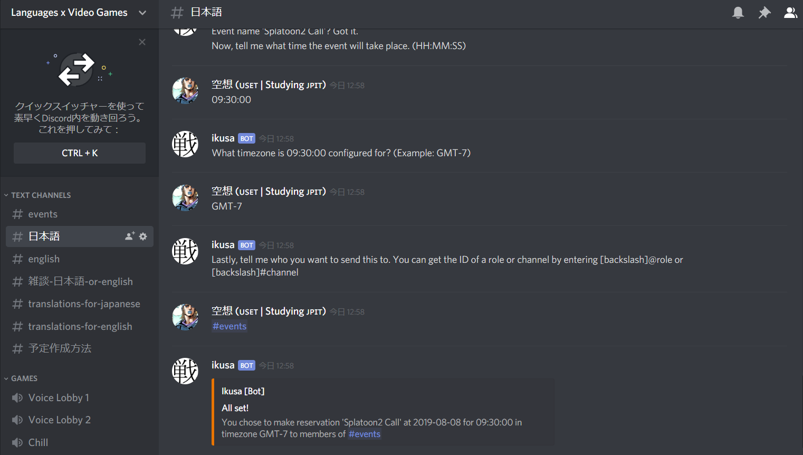

# Ikusa



A simple-to-use and simple-to-maintain flexible Python bot for Discord. Can be used in two ways: 1. command-based and 2. interactively. For multi-word event names please use the interactive mode (by entering `ikusa config` in your designated schedule channel)

## Requirements

+ Python 3 (3.6.8)
+ Discord.py (1.3.0)

### Usage

Clone the repository and replace the bot token and channel ID with those that pertain to your needs. It is recommended to create a seperate channel for scheduling to improve visibility to group members. 

Run the bot by simply running `python ikusa.py`. 

#### Interactive (Recommend)

Interactively use Ikusa by typing `ikusa config` in your schedule channel. The author that runs this command must be the one responding to the ensuing prompts. Additionally, you must be in the same server.

#### Command-Based

The main command is `.start` and it takes several arguments, with the format:

.start (date) (event) (time) (timezone) (role)

Here is an example command:

```
.start 2019-08-06 hangout 01:35:00 gmt-7 <@&608041105207853133>
```

Because coomands parse each space-delimited word as a new argument, there is currently no support for multi-word event names within command-mode. Use the interactive mode if that is something you want. You can get the role or channel ID you want to input as the last argument (the group to mention during event notifications) by setting up Developer Mode within your Discord client and entering "\@role" or "\#channel" as a message for roles and channels, respectively. 

### Notifications

Ikusa will check its records once a day for any events scheduled for the next three days. It will mention the supplied role/channel. In the main ikusa.py file


### Privacy 

Ikusa is meant to be installed and configured locally. The bot does not collect user data.
